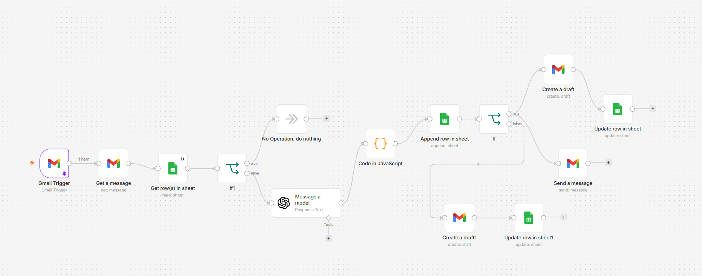
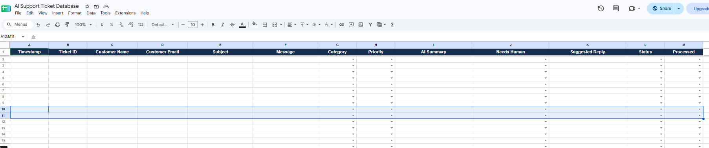
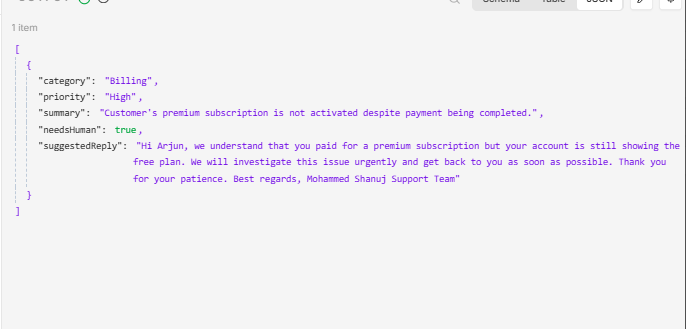
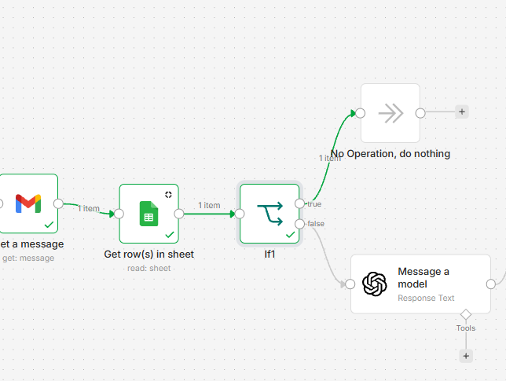
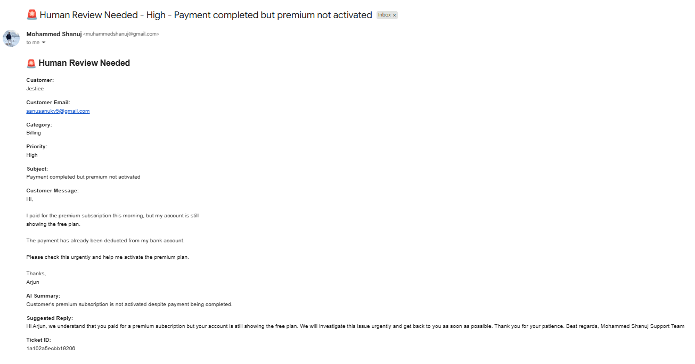
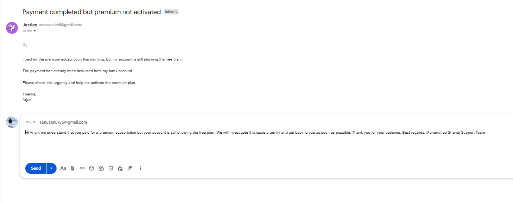
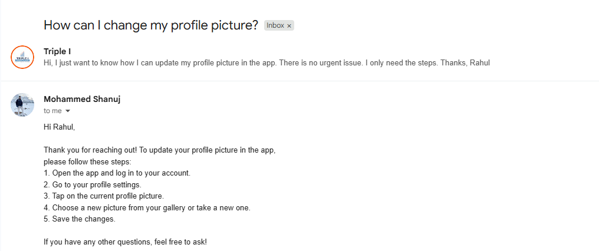

# AI Customer Support Triage Agent

An AI-powered customer support workflow built with **n8n, Gmail, OpenAI, and Google Sheets**. It receives incoming support emails, retrieves the full message body, checks for duplicate tickets, classifies the request, determines priority, prepares a draft response, alerts a human when review is required, and updates ticket status automatically.

> This repository documents a portfolio/demo implementation. Use test or synthetic customer data when showcasing it publicly.

## Problem

Support inboxes often require repetitive manual work: reading each message, identifying the issue type, deciding urgency, drafting a response, escalating sensitive cases, and updating a ticket tracker.

This workflow automates those repetitive steps while keeping a human in the loop for higher-risk tickets.

## Workflow Architecture

```text
Gmail Trigger
   ↓
Get Full Gmail Message
   ↓
Google Sheets Duplicate Check
   ↓
IF Ticket Already Exists?
   ├─ Yes → No Operation
   └─ No
       ↓
AI Support Triage
       ↓
JavaScript JSON Parser
       ↓
Append Ticket to Google Sheets
       ↓
IF needsHuman?
   ├─ true
   │   ├─ Create Draft Reply in Original Thread
   │   ├─ Send Internal Human Review Alert
   │   └─ Update Ticket Status = In Review
   │
   └─ false
       ├─ Create Draft Reply in Original Thread
       └─ Update Ticket Status = Draft Ready
```

### Full n8n workflow



## Core Features

- Monitors incoming Gmail support messages
- Retrieves the full email body instead of relying only on Gmail snippets
- Uses Gmail message ID as a unique Ticket ID
- Prevents duplicate processing using a Google Sheets lookup
- Classifies requests into `Billing`, `Technical`, `Sales`, or `General`
- Assigns `Critical`, `High`, or `Normal` priority
- Produces a concise AI summary
- Decides whether a human must review the request
- Generates a professional suggested reply
- Creates the response as a Gmail draft in the original thread
- Sends an internal alert for tickets requiring human attention
- Logs tickets in Google Sheets
- Updates ticket status after draft creation
- Prevents self-generated alert emails from creating a trigger loop

## Ticket Database

The Google Sheet uses the following columns:

| Column | Purpose |
|---|---|
| Timestamp | Original email date/time |
| Ticket ID | Gmail message ID used as unique identifier |
| Customer Name | Parsed sender name |
| Customer Email | Parsed sender email address |
| Subject | Email subject |
| Message | Full plain-text email body |
| Category | Billing / Technical / Sales / General |
| Priority | Critical / High / Normal |
| AI Summary | Short factual summary |
| Needs Human | Yes / No |
| Suggested Reply | AI-generated draft response |
| Status | New / In Review / Draft Ready / Replied / Closed |
| Processed | Yes / No |

### Ticket database view



## AI Decision Logic

The workflow marks tickets for human review when they involve cases such as:

- payment, refund, or account-specific investigation
- security or privacy concerns
- account access problems
- urgent customer-blocking issues
- cases that cannot be safely resolved from the email alone

General FAQs and simple how-to requests can proceed to the normal draft path without triggering the internal escalation email.

### High-priority AI output



## Duplicate Protection

Before sending an email to the AI model, the workflow searches Google Sheets for the Gmail message ID.

```text
Ticket ID = Gmail message ID
```

If a matching row exists, the workflow routes to a **No Operation** node and stops further processing.

This prevents repeated workflow executions from creating duplicate ticket rows, drafts, or alerts.

### Duplicate-check branch



## Human-in-the-Loop Design

The workflow deliberately creates a **draft** rather than automatically sending customer-facing responses.

For `needsHuman = true`:

1. A reply draft is created in the customer's original Gmail thread.
2. An internal alert is sent to the support owner.
3. The ticket status is changed to `In Review`.
4. A human reviews the response before sending it.

### Human-review alert



### Draft reply for a high-priority ticket



For `needsHuman = false`:

1. A reply draft is created in the original Gmail thread.
2. No escalation alert is sent.
3. The ticket status is changed to `Draft Ready`.

### Normal-ticket draft



## Example High-Priority Ticket

**Customer message**

> I reset my password but now my account is locked and I urgently need access.

Expected AI result:

```json
{
  "category": "Technical",
  "priority": "High",
  "needsHuman": true
}
```

The workflow creates a draft reply and sends a human-review notification.

## Example Normal Ticket

**Customer message**

> How can I change my profile picture in the app?

Expected AI result:

```json
{
  "category": "General",
  "priority": "Normal",
  "needsHuman": false
}
```

The workflow creates a draft reply without sending a human-review alert.

## Technology Stack

| Technology | Usage |
|---|---|
| n8n | Workflow orchestration |
| Gmail | Trigger, message retrieval, draft creation, alerts |
| OpenAI | Classification, prioritization, summary, draft generation |
| JavaScript | Structured JSON cleanup and parsing |
| Google Sheets | Ticket log, duplicate detection, status tracking |

## Security Notes

- Do not commit Gmail credentials, OpenAI keys, OAuth tokens, or n8n credentials.
- Use test/synthetic customer messages in public screenshots.
- Avoid exposing real customer email addresses or confidential support data.
- For production use, use a dedicated support inbox and an internal alert destination that cannot retrigger the same workflow.
- Keep human approval for sensitive or account-specific responses.

## What I Learned

This project combines several practical AI automation patterns:

- event-driven workflow design
- email ingestion and parsing
- structured LLM outputs
- rule-based human escalation
- duplicate protection / idempotency
- human-in-the-loop approval
- branch-specific status management
- prevention of automation feedback loops

## Possible Next Improvements

- Add a knowledge-base/RAG layer for grounded support answers
- Route alerts to Slack or Microsoft Teams instead of the monitored inbox
- Add SLA timers and overdue-ticket alerts
- Add sentiment detection
- Add attachment handling
- Store tickets in a proper CRM/helpdesk platform
- Add approval buttons before sending drafts
- Add analytics for ticket volume, category distribution, and response time

## Status

**V1 complete:** incoming support emails are classified, logged, deduplicated, routed, drafted, escalated when necessary, and tracked automatically.
